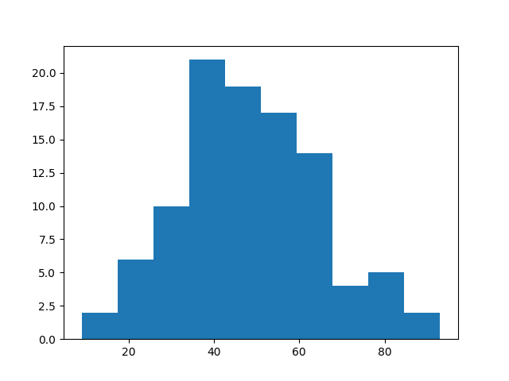
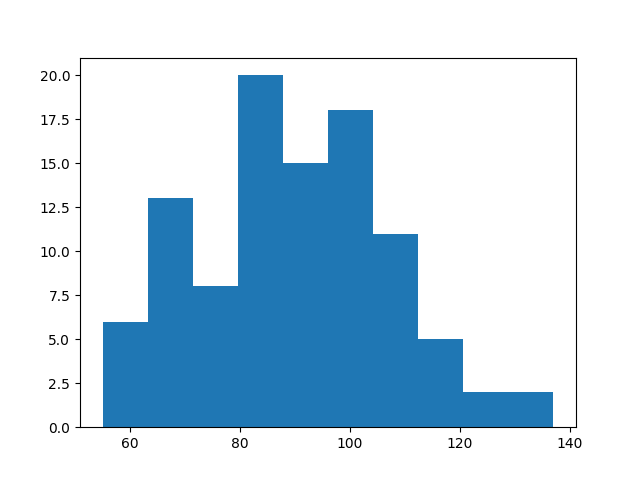
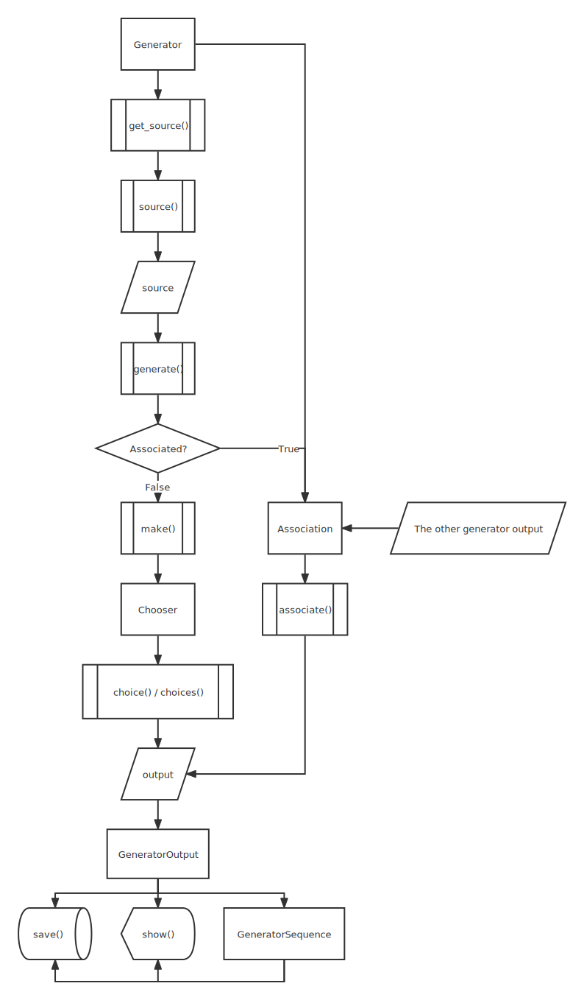

# COOTA

[***Project Home Page***](https://coota.atatc.net) | [*Download Page*](https://coota.atatc.net/download)

[*Detailed Documentation (English)*](https://coota.atatc.net/doc/en) | [*详细文档（中文）*](https://coota.atatc.net/doc/zh)

Join us | 加入我们

------

## What is COOTA

**COOTA**(Come Out Of Thin Air) is a powerful data-generating python library. By supporting generator nesting, it allows you to generate a variety of data that shows great randomness. It also supports making generators conform to a certain distribution and associating two generators.

## Catalog

[TOC]

## Installation

### Python Library

***Requires Python 3.x.***

#### Windows

```shell
pip install coota
```

#### Linux / Mac OS

```shell
pip3 install coota
```

### Application

Go to [*👆🏻download page*](https://coota.atatc.net/download).

## Tutorial

Demo programs can be found under the "tutorial" folder.

### Quick Start

Generate a letter using a **Generator**.

```python
from coota import *


generator = LetterGenerator()
print(generator.generate())
```

This returns a random letter, for example:

```shell
a
```

[*See all built-in generators.*](https://coota.atatc.net/docs)

Generate data in batches using **GeneratorSequence**.

```python
from coota import *


string_length = 2
int_range_from = 0
int_range_to = 10 # not included, which means the generator returns a integer x that matches 0 ≤ x < 10
generator_a = StringGenerator(string_length)
generator_b = IntGenerator(start=int_range_from, stop=int_range_to)
generator_sequence = GeneratorSequence("String: ", generator_a, ", Integer: ", generator_b, n=10)
for data in generator_sequence:
    print(data)
```

This returns 10 groups of data.

```shell
String: Pf, Integer: 6
String: YL, Integer: 9
String: kl, Integer: 8
String: xC, Integer: 4
String: lo, Integer: 2
String: on, Integer: 4
String: uE, Integer: 0
String: or, Integer: 3
String: gj, Integer: 8
String: vl, Integer: 0
```

The default arguments can be generators. For example:

```python
from coota import *


string_length = IntGenerator(start=1, stop=4)
int_range_from = 0
int_range_to = 10
generator_a = StringGenerator(string_length)
generator_b = IntGenerator(start=int_range_from, stop=int_range_to)
generator_sequence = GeneratorSequence("String: ", generator_a, ", Integer: ", generator_b, n=10)
for data in generator_sequence:
    print(data)
```

```shell
String: I, Integer: 5
String: kaK, Integer: 1
String: aCx, Integer: 3
String: I, Integer: 2
String: Ev, Integer: 4
String: RXc, Integer: 4
String: Gh, Integer: 3
String: z, Integer: 6
String: DO, Integer: 3
String: OL, Integer: 2
```

The nesting depth is not limited. Any default argument like `string_length` can be a generator. Global arguments like `int_range_from` and `int_range_to` can also be generators, but they won't be parsed.

### Data Generating

#### Start Using Generators

##### Built-in Generators

###### LetterGenerator

```python
from coota import *


# generate one letter
generator = LetterGenerator()
letter = generator.generate()
print(type(letter), letter)
```

```shell
<class 'str'> L
```

###### StringGenerator

```python
from coota import *


# generate a string of 5 letters
string_length = 5

generator = StringGenerator()
string = generator.generate(string_length)
print(type(string), string)
```

```shell
<class 'str'> ieyDW
```

###### NumberGenerator

```python
from coota import *


# generate a 10 digit number
number_digit = 10

generator = NumberGenerator()
number = generator.generate(number_digit)   # the first digit of the number cannot be zero except 0, like 012
print(type(number), number)
```

```shell
<class 'str'> 4947421207
```

###### LetterAndNumberGenerator

```python
from coota import *


# generate a string of 6 letters and numbers
string_length = 6

generator = LetterAndNumberGenerator()
string = generator.generate(string_length)
print(type(string), string)
```

```shell
<class 'str'> dPgpJ9
```

###### IntGenerator

```python
from coota import *


# generate an integer (0 ≤ x < 10)
range_from, range_to = 0, 10

generator = IntGenerator(start=range_from, stop=range_to)
integer = generator.generate()
print(type(integer), integer)
```

```shell
<class 'int'> 9
```

###### IntIterable

```python
from coota import *


# create an IntIterable
range_from, range_to = 0, 10
step = 1    # optional, 1 by default

iterable_a = IntIterable(start=range_from, stop=range_to, step=step)
integer_a, integer_b = iterable_a.generate(), iterable_a.generate()
print(type(integer_a), integer_a, integer_b)

print("Example in the for loop:")
iterable_b = IntIterable(start=range_from, stop=range_to, step=step)
for integer in iterable_b:
    print(type(integer), integer)
```

```shell
<class 'int'> 0 1
Example in the for loop:
<class 'int'> 0
<class 'int'> 1
<class 'int'> 2
<class 'int'> 3
<class 'int'> 4
<class 'int'> 5
<class 'int'> 6
<class 'int'> 7
<class 'int'> 8
<class 'int'> 9
```

###### TimeGenerator

```python
from coota.preset import *
import datetime


# generate a datetime from April 1, 2022 to June 1, 2022
# can be either str or datetime.datetime object or integer time stamp
range_from, range_to = "2022-4-1", "2022.6.1"   # optional, the default range is from now to next year
# range_from, range_to = datetime.datetime(year=2022, month=4, day=1), datetime.datetime(year=2022, month=6, day=1)
# range_from, range_to = 1648791336, 1654061736

generator = TimeGenerator(start=range_from, stop=range_to)
time = generator.generate()
print(type(time), time)
```

```shell
<class 'datetime.datetime'> 2022-05-24 18:12:00
```

###### EmailGenerator

```python
from coota.preset import *


# generate an email address with a 7-digit name ending with "outlook.com"
domain, name_length = "outlook.com", 7

generator = EmailGenerator(domain=domain)
email = generator.generate(name_length)
print(type(email), email)
```

```shell
<class 'str'> RUSyUY5@outlook.com
```

###### QQMailGenerator

```python
from coota.preset import *


# generate a QQMail address with a 13-digit name
name_length = 13

generator = QQMailGenerator()
qqmail = generator.generate(name_length)
print(type(qqmail), qqmail)
```

```shell
<class 'str'> 7160380273761@qq.com
```

###### NameGenerator

```python
from coota.preset import *


# generate a name
generator = NameGenerator()
name = generator.generate()
print(type(name), name)
```

```shell
<class 'str'> Nikita
```

##### Custom Generators

###### Generator

See the documentation section for a detailed explanation.

```python
from coota import *


class MyGenerator(Generator):
    def source(self) -> Sequence:
        return "option A", "option B", "option C"

    def make(self, *args) -> Any:
        return self.choice()


my_generator = MyGenerator()
option = my_generator.generate()
print(option)
```

```shell
option C
```

###### Iterable Generator

See the documentation section for a detailed explanation.

```python
from coota import *


class MyIterableGenerator(ItertableGenerator):
    def initialize(self) -> None:
        self.set_pointer(0)

    def step(self) -> bool:
        self.set_pointer(self.get_pointer() + 1)
        return self.get_pointer() <= len(self.get_source())

    def source(self) -> Sequence:
        return "A", "B", "C", "D"

    def make(self, *args) -> Any:
        return self.get_source()[self.get_pointer()]


my_iterable_generator = MyIterableGenerator()
for opt in my_iterable_generator:
    print(opt)
```

```shell
A
B
C
D
```

##### Different Ways of Passing Arguments

###### Default Arguments

```python
from coota.preset import *


domain, name_length = "outlook.com", 7

generator = EmailGenerator(domain=domain)
email = generator.generate(name_length)
```

The above example can be replaced by the following code:

```python
from coota.preset import *


domain, name_length = "outlook.com", 7

generator = EmailGenerator(name_length, domain=domain)
email = generator.generate()
```

In other words, the arguments given to `generate()` can be given to the constructor with the same order so that no arguments are necessary in `generate()`.
However, the global arguments for generator can only be given to the constructor. If you don't know much about the argument format of python, the arguments in the form of `name=value` is are global arguments, the others are default arguments.

###### Use a Generator as an Argument

For example, you want to generate a random length string:

```python
from coota import *


string_length = IntGenerator(start=1, stop=10)

generator = StringGenerator()
string = generator.generate(string_length)
# or
generator = StringGenerator(string_length)
string = generator.generate()
```

###### Not Use a Generator as an Argument

If you want to pass the generator intact, there are two ways.

```python
from coota import *


generator = LetterGenerator()
generator.set_parseable(False)
output = generator.generate()
print(type(output), output)
```

```shell
<class 'coota.generator.LetterGenerator'> [Generator({})]
```

```python
from coota import *


generator = LetterGenerator()
output = generator.generate(parse=False)
print(type(output), output)
```

```shell
<class 'coota.generator.LetterGenerator'> [Generator({})]
```

Here's a use case.

```python
from coota import *


class GeneratorGenerator(Generator):
    def source(self) -> Sequence:
        g1 = LetterGenerator()
        g2 = StringGenerator(5)
        return g1, g2

    def make(self, *args) -> Any:
        return self.choice()


generator = GeneratorGenerator()
generator_output = generator.generate(parse=False)
print(type(generator_output), generator_output)
```

```shell
<class 'coota.generator.LetterGenerator'> [Generator({})]
```

#### Generators with Different Choosers (Distributions)

To make the generator fit a certain distribution, you can change the generator's chooser.

Built-in choosers:

- GaussianChooser
- BinomialChooser
- PoissonChooser
- GeomChooser
- ExponChooser

Following demo programs take **GaussianChooser** as an example. The same for other choosers. Some choosers may require additional arguments. More information in the documentation section.

##### Create a Chooser

```python
from coota import *


loc, size = 0, 100

chooser = GaussianChooser()
show(chooser)    # visualize the chooser
```



##### Make a Generator Fit the Distribution

```python
from coota import *


chooser = GaussianChooser()
generator = IntGenerator(start=40, stop=140)
generator.set_chooser(chooser)
result = []
for _ in range(100):
    result.append(generator.generate())
show(result)
```



#### Associate with Another Generator

There is no preset **Association**, so a custom association class must be declared.

For example, the following case shows a demo program that makes the generator fit a random distribution each time.

```python
from coota import *


class DistributionGenerator(Generator):
    def source(self) -> Sequence:
        return DefaultChooser(), GaussianChooser()

    def make(self, *args) -> Any:
        return self.choice()


class MyAssociation(Association):
    def associate(self, g: Any, the_other_generator_output: Any) -> Any:
        g.set_chooser(the_other_generator_output)


generator_a = DistributionGenerator()
generator_b = IntGenerator(start=0, stop=10)
generator_sequence = GeneratorSequence(generator_a, " ", generator_b, n=5)
generator_b.set_association(MyAssociation(generator_a))
for i in generator_sequence:
    print(i)
```

```shell
<coota.generator.DefaultChooser object at 0x1085995e0> 9
<coota.generator.DefaultChooser object at 0x1085995e0> 2
<coota.generator.GaussianChooser object at 0x108599790> 4
<coota.generator.DefaultChooser object at 0x1085995e0> 5
<coota.generator.DefaultChooser object at 0x1085995e0> 9
```

You must have found that this step can be achieved by filling in a generator-type argument. Thus, an **Association** is usually used for the existence of some logical association between two generators rather than random or mathematical association.

The second case shows how an **Association** works in resolving logical problems.

```python
from coota.preset import *
from coota import *


class GenderGenerator(Generator):
    def source(self) -> Sequence:
        return "male", "female"

    def make(self, *args) -> Any:
        return self.choice()


class MyAssociation(Association):
    def associate(self, g: Any, the_other_generator_output: Any) -> Any:
        if the_other_generator_output == "male":
            return g.get_chooser().choice(NAME_MALE)
        else:
            return g.get_chooser().choice(NAME_FEMALE)


generator_a = GenderGenerator()
generator_b = NameGenerator()
generator_sequence = GeneratorSequence("{'sex': '", generator_a, "', 'name': '", generator_b, "'}", n=5)
generator_b.set_association(MyAssociation(generator_a))
for i in generator_sequence:
    print(i)
```

```json
{'sex': 'female', 'name': 'Dora'}
{'sex': 'female', 'name': 'Joan'}
{'sex': 'male', 'name': 'Benson'}
{'sex': 'male', 'name': 'Garfield'}
{'sex': 'male', 'name': 'Paul'}
```

In this example, I want to generate five random names containing gender. However, if the two generators are independent of each other, there may be a man with a female name. That's what an **Association** is for.

#### Generator Sequence

A **GeneratorSequence** provides a convenient way to generate a batch of data.

For example, to generate some information in a string.

```python
from coota import *
from coota.preset import *


gs = GeneratorSequence("Hello, my name is ", NameGenerator(), ". ", n=10)
for i in gs:
	print(i)
```

```shell
Hello, my name is Keith. 
Hello, my name is Allison. 
Hello, my name is Eugene. 
Hello, my name is Helena. 
Hello, my name is Sabrina. 
Hello, my name is Ian. 
Hello, my name is Alina. 
Hello, my name is Carry. 
Hello, my name is Oliver. 
Hello, my name is Adelaide. 
```

It can be also used in generating json strings.

### Data Saving

Following cases take a **Generator** as an example. The same for other objects. More information in the documentation section.

Supported objects:

- **Chooser**
- **Association**
- **Generator**
- **GeneratorOutput**
- **GeneratorSequence**

#### Save

```python
from coota import *


path = "generator.g"

generator = LetterGenerator()
save(generator, path)
```

#### Load

```python
from coota import *


path = "generator.g"

generator = load(path)
# or
generator = GeneratorOperator(path).load()
```

## Documentation

General flow path:



### Chooser

```python
class Chooser(object):
```

#### `abstract:choice()`

This method specifies how the chooser selects an item.

```python
@abstractmethod
def choice(self, x: Sequence) -> Any:
```

| Name   | Usage                                           |
| ------ | ----------------------------------------------- |
| x      | The data source from which the chooser chooses. |
| return | A single item chosen from `x`.                  |

#### `abstract:choices()`

This method specifies how the chooser selects a batch of items.

```python
@abstractmethod
def choices(self, x: Sequence, n: int) -> Sequence:
```

| Name   | Usage                                           |
| ------ | ----------------------------------------------- |
| x      | The data source from which the chooser chooses. |
| n      | The number of choices.                          |
| return | A list of items chosen from `x`.                |

### Association

```python
class Association(object):
```

#### `__init__()`

```python
def __init__(self, the_other_generator: Generator):
```

| Name                | Usage                                                        |
| ------------------- | ------------------------------------------------------------ |
| the_other_generator | The other generator associated with this generator. That generator must generate before this generator. |

#### `get_the_other_generator`

```python
def get_the_other_generator(self) -> Generator:
```

| Name   | Usage                |
| ------ | -------------------- |
| return | The other generator. |

#### `abstract:associate()`

This method specifies the association between the output of two generators.

```python
@abstractmethod
def associate(self, g: Any, the_other_generator_output: Any) -> Any:
```

| Name                       | Usage                                                        |
| -------------------------- | ------------------------------------------------------------ |
| G                          | The generator whose `set_association()` is called with the association given to. |
| the_other_generator_output | The output generated by the other generator.                 |
| return                     | Anything. If not none, the return will be returned by `generate()`, or the process will continue. |

### GeneratorOutput

```python
class GeneratorOutput(object):
```

#### `__init__()`

```python
def __init__(self, output: Any):
```

| Name   | Usage       |
| ------ | ----------- |
| output | The output. |

#### `get_output()`

```python
def get_output(self) -> Any:
```

| Name   | Usage       |
| ------ | ----------- |
| return | The output. |

### Generator

```python
class Generator(object):
```

#### `__init__()`

```python
def __init__(self, *default_args, **args):
```

| Name         | Usage                                                        |
| ------------ | ------------------------------------------------------------ |
| default_args | Given to `make()` when no arguments are given to `generate()`. For example, in a **GeneratorSequence**, `generate()` is called with no arguments, then the `default_args` will be given to `make()`. Required arguments are listed in the specific generators. |
| args         | Global arguments for the generator. Required arguments are listed in the specific generators. |

#### `_get_source_cache()`

```python
def _get_source_cache(self) -> Union[Sequence, None]:
```

| Name   | Usage                    |
| ------ | ------------------------ |
| return | The cache of the source. |

#### `_set_source_cache()`

```python
def _set_source_cache(self, source_cache: Sequence) -> None:
```

| Name         | Usage                    |
| ------------ | ------------------------ |
| source_cahce | The cache of the source. |
| return       |                          |

#### `_get_last()`

```python
def _get_last(self) -> Any:
```

| Name   | Usage                |
| ------ | -------------------- |
| return | Last generated data. |

#### `_set_last()`

```python
def _set_last(self, last: Any) -> None:
```

| Name   | Usage                |
| ------ | -------------------- |
| last   | Last generated data. |
| return |                      |

#### `get_parseable()`

```python
def get_parseable(self) -> bool:
```

| Name   | Usage                                               |
| ------ | --------------------------------------------------- |
| return | Whether the generator can be parsed as an argument. |

#### `set_parseable()`

```python
def set_parseable(self, parseable: bool) -> None:
```

| Name      | Usage                                                        |
| --------- | ------------------------------------------------------------ |
| parseable | Whether the generator can be parsed as an argument. If false, the generator will be recognized as an argument itself instead of being parsed into an actual output. |
| return    |                                                              |

#### `get_uc()`

```python
def get_uc(self) -> bool:
```

| Name   | Usage                                               |
| ------ | --------------------------------------------------- |
| return | Whether the generator uses the cache of the source. |

#### `set_uc()`

```python
def set_uc(self, use_cache: bool) -> None:
```

| Name      | Usage                                                        |
| --------- | ------------------------------------------------------------ |
| use_cache | Whether the generator uses the cache of the source. If true, the generator will only call `source()` once and use the cache instead after that. It's true by default. Set it to false if your source is not always static. |
| return    |                                                              |

#### `get_args()`

```python
def get_args(self) -> dict:
```

| Name   | Usage                                  |
| ------ | -------------------------------------- |
| return | The global arguments of the generator. |

#### `get_arg()`

```python
def get_arg(self, name: str, required_type: type = object) -> Any:
```

| Name          | Usage                                                        |
| ------------- | ------------------------------------------------------------ |
| name          | The argument's name.                                         |
| required_type | The type of argument you require. If any type of argument is acceptable, set it to `object` which is also by default. |
| return        | The argument's value. It can be `None` if the argument does not exist or is not of the same type as required. |

#### `get_arg_or_default()`

```python
def get_arg_or_default(self, name: str, default: Any, required_type: type = object) -> Any:
```

| Name          | Usage                                                        |
| ------------- | ------------------------------------------------------------ |
| name          | The argument's name.                                         |
| default       | The default value.                                           |
| required_type | The type of argument you require. If any type of argument is acceptable, set it to `object` which is also by default. |
| return        | The argument's value. The default value will be returned if the argument does not exist or is not of the same type as required. |

#### `get_required_arg()`

```python
def get_required_arg(self, name: str, required_type: type = object) -> Any:
```

| Name          | Usage                                                        |
| ------------- | ------------------------------------------------------------ |
| name          | The argument's name.                                         |
| required_type | The type of argument you require. If any type of argument is acceptable, set it to `object` which is also by default. |
| return        | The argument's value.                                        |

| Exception      | Case                                              |
| -------------- | ------------------------------------------------- |
| AttributeError | The argument does not exist.                      |
| TypeError      | The argument is not of the same type as required. |

#### `get_default_args()`

```python
def get_default_args(self) -> tuple:
```

| Name   | Usage                                          |
| ------ | ---------------------------------------------- |
| return | The default arguments to be given to `make()`. |

#### `get_chooser()`

```python
def get_chooser(self) -> Chooser:
```

| Name   | Usage                    |
| ------ | ------------------------ |
| return | The generator's chooser. |

#### `set_chooser()`

```python
def set_chooser(self, chooser: Chooser) -> None:
```

| Name    | Usage                                                        |
| ------- | ------------------------------------------------------------ |
| chooser | Set the generator's chooser. A **DefaultChooser** is used by default. If you want to change the behavior of choosing, such as making it fit a certain distribution, you can do so by changing the chooser object. |
| return  |                                                              |

#### `get_association()`

```python
def get_association(self) -> Union[Associatoin, None]:
```

| Name   | Usage                                     |
| ------ | ----------------------------------------- |
| return | The association with the other generator. |

#### `set_association()`

```python
def set_association(self, association: Association) -> None:
```

| Name        | Usage                                     |
| ----------- | ----------------------------------------- |
| association | The association with the other generator. |
| return      |                                           |

#### `choice()`

```python
def choice(self) -> Any:
```

| Name   | Usage                                                  |
| ------ | ------------------------------------------------------ |
| return | One single item chosen from the source by the chooser. |

#### `choices()`

```python
def choices(self, n: int) -> Sequence:
```

| Name   | Usage                                                   |
| ------ | ------------------------------------------------------- |
| n      | The number of items.                                    |
| return | A batch of items chosen from the source by the chooser. |

#### `abstract:source()`

This method specifies what data the generator may generate.

```python
@abstractmethod
def source(self) -> Sequence:
```

| Name   | Usage                                                  |
| ------ | ------------------------------------------------------ |
| return | The original dataset from which the generator selects. |

#### `get_source()`

```python
def get_source(self) -> Sequence:
```

| Name   | Usage                                                        |
| ------ | ------------------------------------------------------------ |
| return | The same as `source()` returns. If `use_cache` is true, returns the source cache instead. |

#### `abstract:make()`

This method specifies how to generate data.

```python
@abstractmethod
def make(self, *args) -> Any:
```

| Name   | Usage               |
| ------ | ------------------- |
| args   | Optional arguments. |
| return | Anything.           |

#### `generate()`

```python
def generate(self, *args, parse: bool = True) -> Any:
```

| Name   | Usage                                                        |
| ------ | ------------------------------------------------------------ |
| args   | Optional arguments given to `make()`.                        |
| parse  | Whether to resolve the generator in parameters and return values. True: return an output. False: return the generator itself. |
| return | Anything.                                                    |

| Exception   | Case                                                         |
| ----------- | ------------------------------------------------------------ |
| LookupError | The associated generator generated before the generator to which is associated has generated. |

#### `output()`

```python
def output(self, *args, parse: bool = False) -> GeneratorOutput:
```

| Name   | Usage                                                        |
| ------ | ------------------------------------------------------------ |
| args   | Optional arguments given to `make()`.                        |
| parse  | Whether to resolve the generator in parameters and return values. |
| return | The return value of `generate()` wrapped as a **GeneratorOutput**. |

### IterableGenerator

An **IterableGenerator** is an ordered iterator, not a selector. It achieves ordering by adding a pointer to the generator.

```python
class ItertableGenerator(Generator):
```

#### `get_pointer()`

```python
def get_pointer(self) -> Any:
```

| Name   | Usage        |
| ------ | ------------ |
| return | The pointer. |

#### `set_pointer()`

```python
def set_pointer(self, pointer: Any) -> None:
```

| Name    | Usage                              |
| ------- | ---------------------------------- |
| pointer | The pointer which is 0 in default. |
| return  |                                    |

#### `choice()`

```python
def choice(self) -> Any:
```

| Name   | Usage                                                        |
| ------ | ------------------------------------------------------------ |
| return | `self.get_source()[pointer]`. The pointer must be an integer when calling this method. |

#### `choices()`

```python
def choices(self, n: int) -> Sequence:
```

| Name   |                                                              |
| ------ | ------------------------------------------------------------ |
| n      | The number of choices.                                       |
| return | `self.get_source()[pointer: pointer + n]`. The pointer must be an integer when calling this method. |

#### `abstract:initialize()`

This is a callback used to set initialization operations such as pointers.

```python
@abstractmethod
def initialize(self) -> None:
```

| Name   | Usage |
| ------ | ----- |
| return |       |

#### `abstract:step()`

This method specifies how the iterator iterates.

```python
@abstractmethod
def step(self) -> bool:
```

| Name   | Usage                                            |
| ------ | ------------------------------------------------ |
| return | True: continue iteration. False: stop iteration. |

### GeneratorSequence

A **GeneratorSequence** provides a convenient way to generate a batch of data.

#### `__init__()`

```python
def __init__(self, *sequence, n: Union[int, _g.IntGenerator, _g.IntIterable], t: type = str):
```

